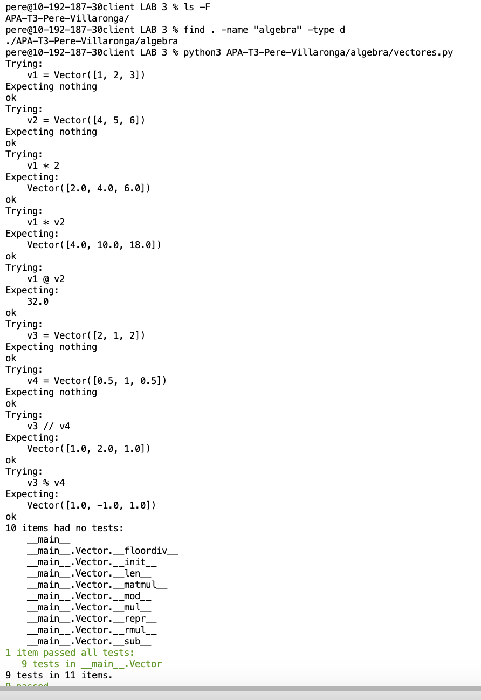

# Tercera práctica de APA: Multiplicación de vectores y ortogonalidad

**Nombre:** Pere Villaronga Folguera

## Ejecución de los tests unitarios
A continuación se muestra la captura de pantalla con el resultado de ejecutar los tests en modo verboso:



## Código desarrollado
A continuación se incluye el código implementado en `algebra/vectores.py`:

```python
"""
Tasca de APA: Multiplicació de vectors i ortogonalitat
Alumne: [Pere Villaronga Folguera]
"""

class Vector:
    """
    Classe per representar vectors i realitzar operacions d'àlgebra lineal.

    >>> v1 = Vector([1, 2, 3])
    >>> v2 = Vector([4, 5, 6])
    >>> v1 * 2
    Vector([2.0, 4.0, 6.0])
    >>> v1 * v2
    Vector([4.0, 10.0, 18.0])
    >>> v1 @ v2
    32.0
    >>> v3 = Vector([2, 1, 2])
    >>> v4 = Vector([0.5, 1, 0.5])
    >>> v3 // v4
    Vector([1.0, 2.0, 1.0])
    >>> v3 % v4
    Vector([1.0, -1.0, 1.0])
    """

    def __init__(self, iterable):
        """Constructor: inicialitza el vector amb una llista de floats."""
        self.elements = [float(x) for x in iterable]

    def __repr__(self):
        """Representació textual del vector."""
        return f"Vector({self.elements})"

    def __len__(self):
        """Retorna la dimensió del vector."""
        return len(self.elements)

    def __sub__(self, other):
        """Resta de dos vectors."""
        return Vector([a - b for a, b in zip(self.elements, other.elements)])

    def __mul__(self, other):
        """Producte de Hadamard (element a element) o multiplicació per escalar."""
        if isinstance(other, (int, float)):
            return Vector([x * other for x in self.elements])
        return Vector([a * b for a, b in zip(self.elements, other.elements)])

    def __rmul__(self, other):
        """Multiplicació per escalar per la dreta."""
        return self * other

    def __matmul__(self, other):
        """Producte escalar (@)."""
        return sum(a * b for a, b in zip(self.elements, other.elements))

    def __floordiv__(self, other):
        """Component paral·lela (//)."""
        # Projecció de self sobre other
        return other * ((self @ other) / (other @ other))

    def __mod__(self, other):
        """Component normal (%)."""
        # Diferència entre el vector i la seva part paral·lela
        return self - (self // other)

if __name__ == "__main__":
    import doctest
    doctest.testmod(verbose=True)
